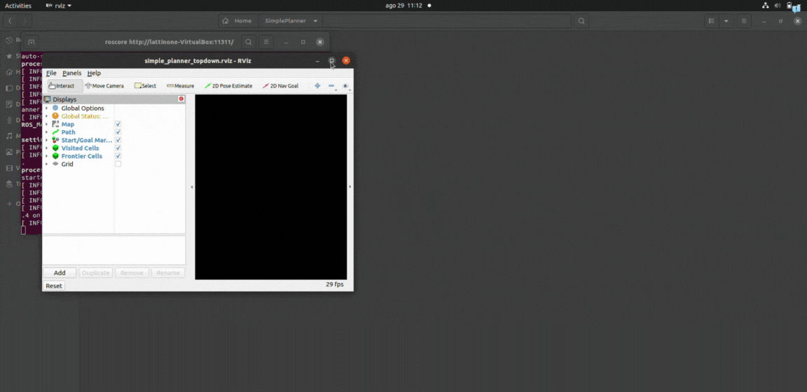

<h1 align="left">Simple Planner</h1>

<p align="left">
  <strong>Clearance-based A* Path Planning in ROS</strong>
</p>

<p align="left">
  <a href="https://opensource.org/licenses/MIT">
    
  </a>
  <a href="https://www.ros.org/">
    
  </a>
  <a href="https://isocpp.org/">
    
  </a>
</p>

<p align="center">
  
</p>

## Overview
**SimplePlanner** is a global planner for mobile robots, built in **C++** and integrated with **ROS**. It computes a collision-free path between the robot’s current position and a user-defined goal on a 2D occupancy map.  
The core of the planner is an **A\*** search algorithm, improved with a **clearance-based cost function** that penalizes paths closer to obstacles.  
This ensures that the robot not only finds a feasible route but also maximizes safety margins from walls and obstacles.  

The project is designed as a minimal example of how to implement grid-based path planning in ROS, providing both functionality and visualization tools to understand how the planner expands and selects the final path.


## How It Works
The planning process in **SimplePlanner** can be divided into four main stages, each of which transforms the raw map and user input into a feasible, safe, and smooth trajectory.

### 1. Map handling
The planner starts from a **2D occupancy map** provided by the standard ROS `map_server`.  
This map is a `nav_msgs/OccupancyGrid` where each cell can be:
- `0` → free space  
- `100` → occupied (obstacle)  
- `-1` → unknown  

The occupancy grid can be converted into a `grid_map_msgs/GridMap` through the `occ_to_gridmap` bridge node, which stores data in a layered grid structure. Regardless of representation, the map is discretized with resolution `r` (meters per cell), and all subsequent computations happen in this grid space.

### 2. Obstacle extraction & costmap generation
Once the map is available, the planner extracts obstacles and computes a **clearance costmap**.  
This involves two key steps:

1. **Distance transform (DT)**  
   Starting from obstacle cells, a **Breadth-First Search (BFS)** expansion propagates through the grid and assigns each free cell the distance $d(i)$ to its nearest obstacle.  
   In practice:

   $$d(i) = \min_{j \in \mathrm{Obstacles}} \; \lVert p_i - p_j \rVert_2$$

   where $p_i$ is the position of cell $i$ in world coordinates.

2. **Clearance-based cost function**  
   Each cell is assigned a traversal penalty that increases as the clearance decreases.  
   The cost is defined as:

   $$c(i) = \frac{\alpha}{\varepsilon + d(i)}$$

   where:
   - $\alpha$ is a tunable weight (`alpha_clearance`)
   - $\varepsilon$ is a small constant to avoid division by zero
   - $d(i)$ is the distance to the closest obstacle

This ensures that paths running close to walls or obstacles become more expensive, encouraging the planner to prefer safer routes.

### 3. Planning (A*)

With the costmap available, the planner runs the **A\*** search algorithm over the grid.

- **Start pose:** automatically retrieved from TF (`map → base_link`) or manually set by the user through `/initialpose`.
- **Goal pose:** provided via `/move_base_simple/goal` (a `geometry_msgs/PoseStamped`) or via `/move_base/goal` (an action message).

For each candidate move from a cell $i$ to a neighbor $j$, the incremental cost is:

$$
g(j) \;=\; g(i) \;+\; \Delta d(i,j) \;+\; c(j)
$$

where:
- $\Delta d(i,j)$ is the Euclidean step cost (1 for horizontal/vertical, $\sqrt{2}$ for diagonal moves).
- $c(j)$ is the clearance penalty from the costmap.

The **heuristic** $h(j)$ is the straight-line distance from cell $j$ to the goal:

$$
h(j) \;=\; \sqrt{(x_j - x_g)^2 \;+\; (y_j - y_g)^2}
$$

The A\* priority is then:

$$
f(j) \;=\; g(j) \;+\; h(j)
$$

This makes the planner both **admissible** (A\* guarantees the shortest-cost path with this heuristic) and **safety-aware** (thanks to the clearance cost term).

### 4. Path output & visualization

Once the goal is reached, the planner reconstructs the path by backtracking through parent links.
The raw path is published as a `nav_msgs/Path`, containing an ordered sequence of poses in the `map` frame.

To make the trajectory smoother and visually clearer, an optional **Chaikin’s corner-cutting algorithm** is applied. This iteratively refines the polyline by generating new intermediate points:

$$
P'_k \;=\; 0.75\,P_k \;+\; 0.25\,P_{k+1} 
$$
$$
Q'_k \;=\; 0.25\,P_k \;+\; 0.75\,P_{k+1}
$$

After a few iterations, the path resembles a smooth curve instead of a jagged polyline.

For visualization, the system publishes:
- **Final path** → blue line (`/simple_planner/path`)
- **Start & goal markers** → blue sphere (start), green sphere (goal)
- **Debug markers**:
  - `/simple_planner/frontier` → frontier cells explored during A\*
  - `/simple_planner/visited` → visited/expanded cells
  - `/simple_planner/cost_debug` → clearance-weighted costmap as an `OccupancyGrid`

This allows the user to follow in RViz not only the final path but also the **internal decision process** of the planner.

## Project Structure
```
SimplePlanner/
├── assets/ # documentation files for the README
├── build/ # build outputs 
├── devel/ # development space 
├── src/
│ ├── simple_planner/ # main package
│ │ ├── include/ # C++ headers 
│ │ ├── launch/ # launch files 
│ │ ├── maps/ # example maps to use
│ │ ├── rviz/ # RViz configuration 
│ │ ├── src/ # C++ sources 
│ │ ├── CMakeLists.txt # package-level build configuration
│ │ └── package.xml # dependencies, metadata
│ ├── CMakeLists.txt # workspace-level CMake 
│ ├── run_simple_planner.sh # helper script (manual /initialpose)
│ └── run_with_tf.sh # helper script (static TF start pose)
├── README.md # project documentation
```

## Run & Test
The project provides two helper scripts that start all the required nodes
(roscore, map server, planner node, and RViz) automatically.  
Both scripts assume you already compiled the workspace and sourced the setup:

```bash
git clone https://github.com/emiliarusso/SimplePlanner.git
cd ~/SimplePlanner
source devel/setup.bash
```
### Option 1: Manual start in RViz
This option disables TF for the start pose.
In RViz, you must manually set:
- 2D Pose Estimate → start position
- 2D Nav Goal → goal position
```bash
./src/run_simple_planner.sh
```
Use this mode if your robot does not publish a map → base_link transform,
or if you want to experiment with arbitrary start/goal poses.

### Option 2: Run with TF
This option enables TF-based start.
The planner takes the robot’s current pose directly from the TF transform map → base_link.
In RViz, you only need to set:
- 2D Nav Goal → goal position
```bash
./src/run_with_tf.sh
```
Use this mode if your robot already broadcasts its pose in the map frame,
or if you just want to quickly test goal-to-goal planning without setting the start manually.